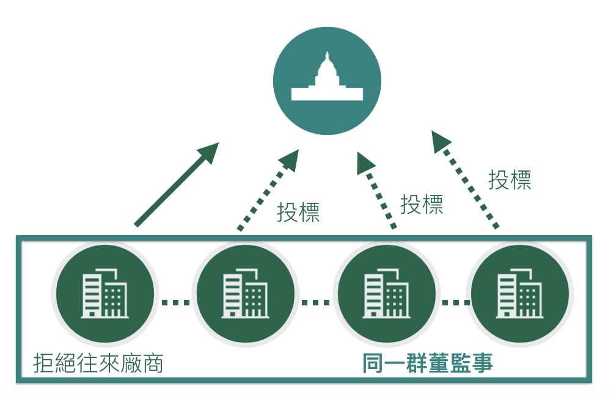
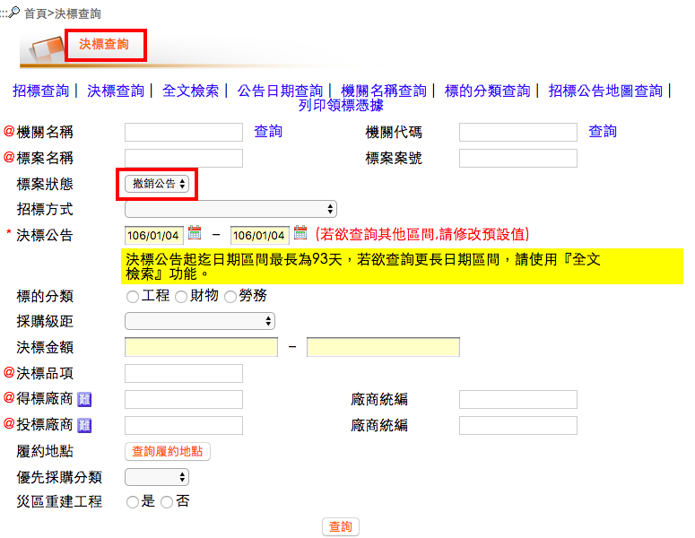

## 黑名單分析

```{r ,out.width = "800px",echo=FALSE,fig.align='center'}

```

---

## 黑名單分析

```{r, 'datatable1', echo=FALSE, warning=FALSE,message=FALSE,cache=FALSE,results='asis'}
cat('<iframe src="dt1.html" width=100% height=100% allowtransparency="true"> </iframe>')
```

--- .segue bg:grey

# 決標標案分析 - 廠商

--- &twocol w1:60% w2:40%

## 決標標案分析 - 廠商
*** =left
   
- Data: 決標 -> 撤銷公告    
  
- Time: 2014 ~ 2016  

*** =right

```{r ,out.width = "800px",echo=FALSE}

```

--- 

## 撤銷公告問題
  
從 "撤銷公告原因及依據法條" 可看到一些有趣的事情
  
- 廠商問題:
撤銷公告原因及依據法條   
  
- 本案得標廠商「XXXX」未依規定履行契約，且經本局數次聯絡皆表示無履約意願   
- XXXX有限公司得標後拒不簽約   
- 廠商之信用證明逾期   
- XXXX公司登記證已於105年4月13日註銷，應撤銷決標、終止契約或解除契約，並得追償損失。   

--- 

## Top 5 機關遭雷

```{r ,echo=FALSE,warning=FALSE,message=FALSE}
library(plyr)
library(dplyr)
library(plotly)
library(ggplot2)
library(gridExtra)
library(grid)

company <- read.csv('/Users/Dan/Desktop/company_analysis.csv')
company <- mutate(company,count=1)
at <- ddply(company,~機關名稱,summarise,sum=sum(count))
at <- at[order(-at$sum),]
at <- at[1:5,]
thm <- function() theme(text=element_text(size = 15, family = "STHeiti"))
g <-ggplot(at, aes(x=reorder(機關名稱,-sum), y=sum, fill=機關名稱))+ geom_bar(stat="identity")+
      xlab("Company")+theme_grey(base_family="STHeiti")+
      theme(axis.text.x=element_text(angle = 15,hjust = 1))+ggtitle("Top 5 company")
p <- ggplotly(g)
htmlwidgets::saveWidget(as.widget(p), "wp.html")
```

```{r wp, echo=FALSE, warning=FALSE, cache=FALSE, results='asis'}
cat('<iframe src="wp.html" width=100% height=10% allowtransparency="true"> </iframe>')
```
  
---

--- &twocol

## 決標方式 ＆ 類別

*** =left

```{r ,echo=FALSE,warning=FALSE,message=FALSE}
way <- ddply(company,~決標方式,summarise,sum=sum(count))
company$標的分類 <- substr(company$標的分類,start=2,stop=4)
class <- ddply(company,~標的分類,summarise,sum=sum(count))
at <- at[order(-at$sum),]
at <- at[1:5,]
thm <- function() theme(text=element_text(size = 15, family = "STHeiti"))
g <-ggplot(class, aes(x=reorder(標的分類,-sum), y=sum, fill=標的分類))+ geom_bar(stat="identity")+
      xlab("標的分類")+theme_grey(base_family="STHeiti")+
      theme(axis.text.x=element_text(angle = 15,hjust = 1))+ggtitle("標的分類 Count")+ guides(fill=FALSE)
p <- ggplotly(g) %>% layout(showlegend = FALSE)


htmlwidgets::saveWidget(as.widget(p), "wp1.html")
```

```{r , echo=FALSE, warning=FALSE, cache=FALSE, results='asis'}
cat('<iframe src="wp1.html" width=100% height=10% allowtransparency="true"> </iframe>')
```

*** =right  
  
```{r ,echo=FALSE,warning=FALSE,message=FALSE}
g1 <-ggplot(way, aes(x=reorder(決標方式,-sum), y=sum, fill=決標方式))+ geom_bar(stat="identity")+
      xlab("決標方式")+theme_grey(base_family="STHeiti")+
      theme(axis.text.x=element_text(angle = 15,hjust = 1))+ggtitle("決標方式 Count")
p1 <- ggplotly(g1) %>% layout(showlegend = FALSE)
htmlwidgets::saveWidget(as.widget(p1), "wp2.html")
```
```{r wp2, echo=FALSE, warning=FALSE, cache=FALSE, results='asis'}
cat('<iframe src="wp2.html" width=100% height=10% allowtransparency="true"> </iframe>')
```

--- 

## 被雷金額

母體介於 30萬至 140萬之間  
大多較有問題的標案大多range僅在 20萬到60萬之間  
  
```{r ,echo=FALSE,warning=FALSE,message=FALSE, fig.align='center'}
company <- company[complete.cases(company),]

company$總決標金額 <- as.character(as.factor(company$總決標金額))
company$總決標金額 <- gsub('元',replacement="",company$總決標金額)
company$總決標金額 <- gsub(',', replacement='',company$總決標金額)
company$總決標金額 <- as.numeric(as.character(company$總決標金額))
company <- mutate(company,type='Bug')

bp <- ggplot(data=company, aes(x=type, y=總決標金額)) + geom_boxplot()+theme_grey(base_family="STHeiti")
bp

```

--- .segue bg:grey

# 決標標案分析 - 政府  

---

## 政府問題

- 大多為資料填錯導致流標

- 尤其是'案號'誤繕等

- 是否效率或是SOP等需要改善

---

## 單位填錯排名

仍為台灣大學以及中國石油！！！  

```{r ,echo=FALSE,warning=FALSE,message=FALSE, fig.align='center'}

gov <- read.csv('/Users/Dan/Desktop/gov.csv')
gov <- mutate(gov,count=1)
way <- ddply(gov,~機關名稱,summarise,sum=sum(count))
way <- way[order(-way$sum),]
way <- way[1:5,]
thm <- function() theme(text=element_text(size = 15, family = "STHeiti"))
g <-ggplot(way, aes(x=reorder(機關名稱,-sum), y=sum, fill=機關名稱))+ geom_bar(stat="identity")+
      xlab("機關名稱")+theme_grey(base_family="STHeiti")+
      theme(axis.text.x=element_text(angle = 15,hjust = 1))+ggtitle("機關名稱 Count")
g
```

--- &twocol

## 決標方式 ＆ 類別

*** =left

```{r ,echo=FALSE,warning=FALSE,message=FALSE}
way <- ddply(gov,~決標方式,summarise,sum=sum(count))
gov$標的分類 <- substr(gov$標的分類,start=2,stop=4)
class <- ddply(gov,~標的分類,summarise,sum=sum(count))
class <- class[order(-class$sum),]
thm <- function() theme(text=element_text(size = 15, family = "STHeiti"))
g <-ggplot(class, aes(x=reorder(標的分類,-sum), y=sum, fill=標的分類))+ geom_bar(stat="identity")+
      xlab("標的分類")+theme_grey(base_family="STHeiti")+
      theme(axis.text.x=element_text(angle = 15,hjust = 1))+ggtitle("標的分類 Count")+ guides(fill=FALSE)
p <- ggplotly(g) %>% layout(showlegend = FALSE)


htmlwidgets::saveWidget(as.widget(p), "wp4.html")
```

```{r , echo=FALSE, warning=FALSE, cache=FALSE, results='asis'}
cat('<iframe src="wp4.html" width=100% height=10% allowtransparency="true"> </iframe>')
```

*** =right  
  
```{r ,echo=FALSE,warning=FALSE,message=FALSE}
g1 <-ggplot(way, aes(x=reorder(決標方式,-sum), y=sum, fill=決標方式))+ geom_bar(stat="identity")+
      xlab("決標方式")+theme_grey(base_family="STHeiti")+
      theme(axis.text.x=element_text(angle = 15,hjust = 1))+ggtitle("決標方式 Count")
p1 <- ggplotly(g1) %>% layout(showlegend = FALSE)
htmlwidgets::saveWidget(as.widget(p1), "wp5.html")
```
```{r w, echo=FALSE, warning=FALSE, cache=FALSE, results='asis'}
cat('<iframe src="wp5.html" width=100% height=10% allowtransparency="true"> </iframe>')
```

---

## 流廢標價位

- 金額  
  
因失誤導致流廢標金額約在20萬到200萬之間，最高有到16億  
  
```{r ,echo=FALSE,warning=FALSE,message=FALSE,fig.align='center'}
gov <- gov[complete.cases(gov),]

gov$總決標金額 <- as.character(as.factor(gov$總決標金額))
gov$總決標金額 <- gsub('元',replacement="",gov$總決標金額)
gov$總決標金額 <- gsub(',', replacement='',gov$總決標金額)
gov$總決標金額 <- as.numeric(as.character(gov$總決標金額))
gov <- mutate(gov,type='Bug')

bp <- ggplot(data=gov, aes(x=type, y=總決標金額)) + geom_boxplot()+theme_grey(base_family="STHeiti")
bp
```


---

## Summary

- 廠商失能  
  
  較多出現於，財務類。金額約於20萬～60萬  
  
  -> 可能因金額較少，所以在監督上較少著墨。  
  
- 政府失能  
  
  在分析後我們覺得，應是常態性的失誤。
  
  -> 所有分配皆接近母體。可能在於SOP或是資料填寫上需要有一些防呆機制。  
    

--- .segue bg:grey

# Other things...... 

---  
   
## 接案王

- 決標 -> 決標公告
```{r ,echo=FALSE,warning=FALSE,message=FALSE,fig.align='center'}
company_win <- read.csv("/Users/Dan/Desktop/company_final.csv")
company_win <- mutate(company_win,count=1)
win<- ddply(company_win,~投標公司,summarise,sum=sum(count))
win <- win[order(-win$sum),]
win <- win[1:5,]
g1 <-ggplot(win, aes(x=reorder(投標公司,-sum), y=sum, fill=投標公司))+ geom_bar(stat="identity")+
      xlab("投標公司")+theme_grey(base_family="STHeiti")+
      theme(axis.text.x=element_text(angle = 15,hjust = 1))+ggtitle("得標公司 Count")
g1
```

---

## 大熱門

- 決標 -> 決標公告  
hot = 投標公司比率  
(勞務類&最有利標)
```{r ,echo=FALSE,warning=FALSE,message=FALSE,fig.align='center'}
company_win <- read.csv("/Users/Dan/Desktop/company_final.csv")
company_win <- mutate(company_win,count=1)
company_win$標的分類 <- substr(company_win$標的分類,start=2,stop=4)
win<- ddply(company_win,~機關名稱+標的分類+決標方式,summarise,sum=sum(count))
ag <- ddply(company_win,~機關名稱+標的分類+決標方式,summarise,sum=sum(投標公司數))
win <- cbind(win,ag[4]) 
win <- subset(win,win$機關名稱!="")
win <- mutate(win,hot=win[,5]/win[,4])
win <- subset(win,win$sum>1&win$標的分類=='勞務類'&win$決標方式=='準用最有利標')

win <- win[order(-win$hot),]
win <- win[1:5,]
g1 <-ggplot(win, aes(x=reorder(機關名稱,-hot), y=hot, fill=機關名稱))+ geom_bar(stat="identity")+
      xlab("機關名稱")+theme_grey(base_family="STHeiti")+
      theme(axis.text.x=element_text(angle = 15,hjust = 1))+ggtitle("機關名稱 Count")
g1
```

--- .segue bg:grey

# [Demo]("https://rickychang.shinyapps.io/DSP_opendata_project/")


