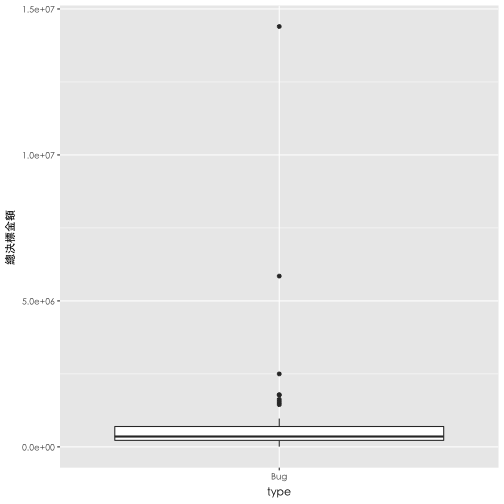
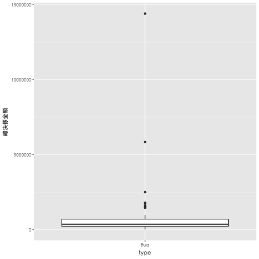
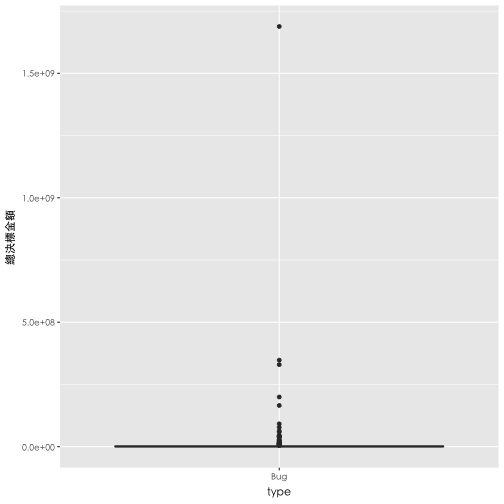
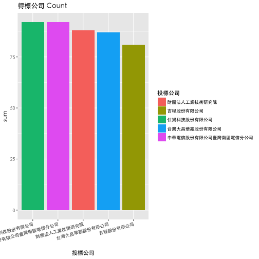
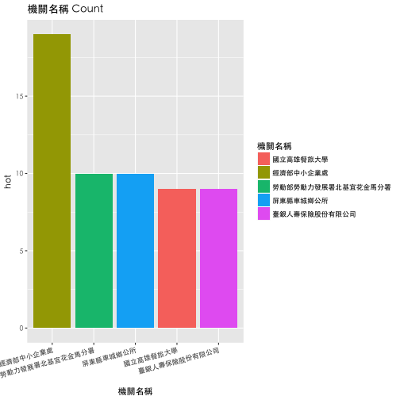

## 黑名單分析

---

## 黑名單分析

<iframe src="dt1.html" width=100% height=100% allowtransparency="true"> </iframe>

--- .segue bg:grey

# 決標標案分析 - 廠商

--- &twocol w1:60% w2:40%

## 決標標案分析 - 廠商
*** =left
   
- Data: 決標 -> 撤銷公告    
  
- Time: 2014 ~ 2016  

*** =right

--- 

## 撤銷公告問題
  
從 "撤銷公告原因及依據法條" 可看到一些有趣的事情
  
- 廠商問題:
撤銷公告原因及依據法條   
  
- 本案得標廠商「XXXX」未依規定履行契約，且經本局數次聯絡皆表示無履約意願   
- XXXX有限公司得標後拒不簽約   
- 廠商之信用證明逾期   
- XXXX公司登記證已於105年4月13日註銷，應撤銷決標、終止契約或解除契約，並得追償損失。   

--- 

## Top 5 機關遭雷

<iframe src="wp.html" width=100% height=10% allowtransparency="true"> </iframe>
  
---

--- &twocol

## 決標方式 ＆ 類別

*** =left

<iframe src="wp1.html" width=100% height=10% allowtransparency="true"> </iframe>

*** =right  
  

<iframe src="wp2.html" width=100% height=10% allowtransparency="true"> </iframe>

--- 

## 被雷金額

母體介於 30萬至 140萬之間  
大多較有問題的標案大多range僅在 20萬到60萬之間  
  

--- .segue bg:grey

# 決標標案分析 - 政府  

---

## 政府問題

- 大多為資料填錯導致流標

- 尤其是'案號'誤繕等

- 是否效率或是SOP等需要改善

---

## 單位填錯排名

仍為台灣大學以及中國石油！！！  

--- &twocol

## 決標方式 ＆ 類別

*** =left

<iframe src="wp4.html" width=100% height=10% allowtransparency="true"> </iframe>

*** =right  
  

<iframe src="wp5.html" width=100% height=10% allowtransparency="true"> </iframe>

---

## 流廢標價位

- 金額  
  
因失誤導致流廢標金額約在20萬到200萬之間，最高有到16億  
  

---

## Summary

- 廠商失能  
  
  較多出現於，財務類。金額約於20萬～60萬  
  
  -> 可能因金額較少，所以在監督上較少著墨。  
  
- 政府失能  
  
  在分析後我們覺得，應是常態性的失誤。
  
  -> 所有分配皆接近母體。可能在於SOP或是資料填寫上需要有一些防呆機制。  
    

--- .segue bg:grey

# Other things...... 

---  
   
## 接案王

- 決標 -> 決標公告

---

## 大熱門

- 決標 -> 決標公告  
hot = 投標公司比率  
(勞務類&最有利標)

--- .segue bg:grey

# [Demo](https://rickychang.shinyapps.io/DSP_opendata_project/)

