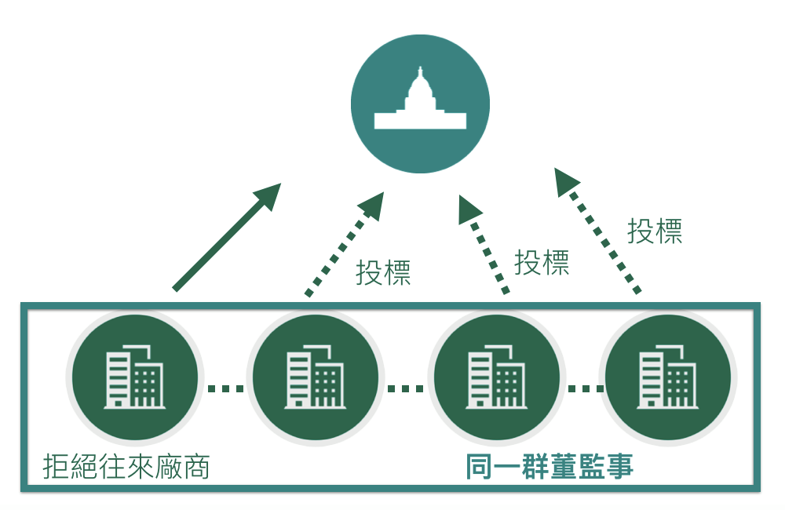

## 黑名單分析



---

## 黑名單分析

<iframe src=""dt1.html" width=100% height=100% allowtransparency="true"> </iframe>

--- .segue bg:grey

# 決標標案分析 - 廠商

--- &twocol w1:60% w2:40%

## 決標標案分析 - 廠商
*** =left
   
- Data: 決標 -> 撤銷公告    
  
- Time: 2014 ~ 2016  

*** =right


--- 

## What we see at this data
  
從 "撤銷公告原因及依據法條" 可看到一些有趣的事情
  
- 廠商問題:
撤銷公告原因及依據法條   
  
- 本案得標廠商「XXXX」未依規定履行契約，且經本局數次聯絡皆表示無履約意願   
- XXXX有限公司得標後拒不簽約   
- 廠商之信用證明逾期   
- XXXX公司登記證已於105年4月13日註銷，應撤銷決標、終止契約或解除契約，並得追償損失。   

--- 

## Top 5 機關遭雷


<iframe src="/Users/Dan/Dan/wp.html" width=100% height=10% allowtransparency="true"> </iframe>
  
---

--- &twocol

## 決標方式 ＆ 類別

*** =left


<iframe src="/Users/Dan/Dan/wp1.html" width=100% height=10% allowtransparency="true"> </iframe>

*** =right  
  

<iframe src="/Users/Dan/Dan/wp2.html" width=100% height=10% allowtransparency="true"> </iframe>

---

## 被雷價位


整體決標金額

```
##        Min.     1st Qu.      Median        Mean     3rd Qu.        Max. 
##           0      310000      777800    14570000     2425000 79960000000
```
有問題決標金額

```
##     Min.  1st Qu.   Median     Mean  3rd Qu.     Max. 
##     8000   223600   355000   773900   697800 14400000
```


--- 

## Boxplot

母體介於 140萬至30萬之間
大多較有問題的標案大多range僅在 60萬到20萬之間
  


--- .segue bg:grey

# 決標標案分析 - 政府  

---

## 政府問題

- 大多為資料填錯導致流標

- 尤其是'案號'誤繕等

- 是否效率或是SOP等需要改善

---

## 單位填錯排名

國防部為大戶 填錯 大戶 !!!
(P.S 拜託別查我們水表)


--- .segue bg:grey

# Demo


